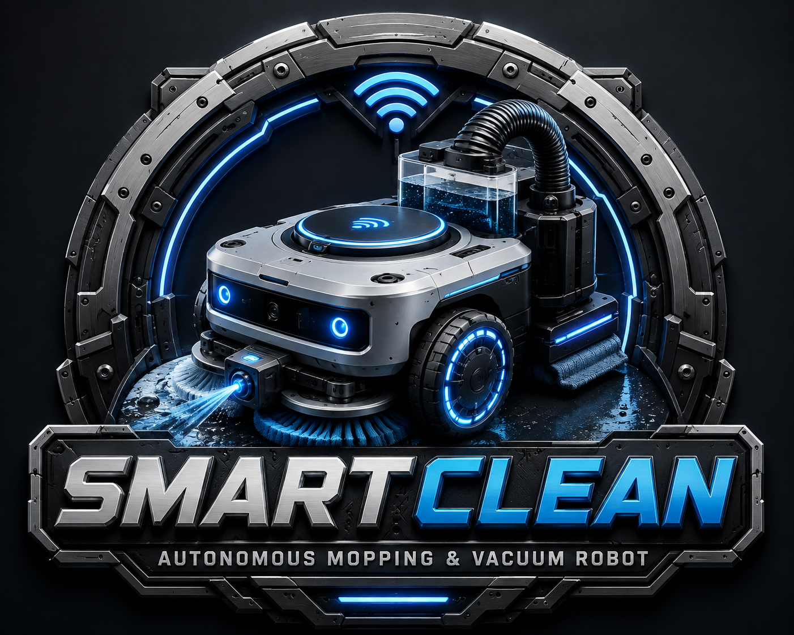

<p align="center">
  
</p>

<h1 align="center">SmartClean-Robot</h1>

<p align="center">ESP32-based smart autonomous cleaning robot with vacuum, hydraulic mopping, obstacle avoidance, and responsive web control.</p>

<p align="center">
  
  
</p>

<p align="center">
  
</p>

<p align="center"><em>How the robot behaves in Automatic Mode — detect, stop, turn toward free space, continue.</em></p>

---

## Overview

SmartClean-Robot is an ESP32-based cleaning system designed to reduce manual effort in routine floor cleaning. It combines automatic navigation, obstacle and edge detection, wet mopping, water spraying, and vacuum cleaning, controlled through a responsive web dashboard that works on both smartphones and laptops — no separate mobile app required.

> **Note:** This project uses sensor-based reactive automation, not AI/ML or SLAM. See [Limitations](#limitations) below.

---

## Features

- **Manual Mode** — direct control via large on-screen buttons (Forward, Backward, Left, Right, Stop)
- **Automatic Mode** — reactive obstacle avoidance using ultrasonic sensors
- **Edge/Cliff Detection** — IR sensor stops the robot near table edges or stairs
- **Wet Mopping** — motorized mop pad with controlled water spray
- **Vacuum Cleaning** — BLDC-driven suction for dust and debris
- **Live Web Dashboard** — real-time sensor readouts, no page refresh needed
- **Mode Indicator** — always shows current mode (MANUAL / AUTO)
- **Emergency Stop** — external safety switch support
- **Mobile & Desktop Friendly** — responsive UI, works on any screen size

---

## Hardware Components

| Component | Purpose |
|---|---|
| ESP32 | Main controller, Wi-Fi access point, web server |
| L298N Motor Driver | Drives left and right DC motors |
| 2x DC Motors + Wheels | Robot locomotion |
| 3x HC-SR04 Ultrasonic Sensors | Front, left, right obstacle detection |
| IR Sensor | Cliff / edge detection |
| Relay Module(s) | Switches vacuum, pump, and mop loads |
| Mini DC Water Pump | Supplies water for mopping |
| BLDC Motor | Vacuum suction |
| Mopping Mechanism | Physical floor contact/cleaning |
| Water Tank + Tubing + Nozzle | Water delivery system |
| Power Supply / Battery | System power |
| Emergency Stop Switch | External safety cutoff |

---

## Pin Connections

### Motor Driver (L298N)

| L298N Pin | ESP32 GPIO |
|---|---|
| ENA | GPIO 25 |
| IN1 | GPIO 26 |
| IN2 | GPIO 27 |
| IN3 | GPIO 14 |
| IN4 | GPIO 12 |
| ENB | GPIO 13 |

### Ultrasonic Sensors

| Sensor / Pin | ESP32 GPIO |
|---|---|
| Front TRIG | GPIO 22 |
| Front ECHO | GPIO 23 |
| Right TRIG | GPIO 19 |
| Right ECHO | GPIO 21 |
| Left TRIG | GPIO 33 |
| Left ECHO | GPIO 34 |

> **Important:** GPIO 34 is input-only on the ESP32. It must only be used as an ECHO input, never as a TRIG output. Standard HC-SR04 modules output 5V on ECHO — use a voltage divider or logic-level shifter before connecting to any ESP32 GPIO, especially GPIO 34.

### Cleaning & Safety Pins

| Function | ESP32 GPIO |
|---|---|
| MOP | GPIO 18 |
| PUMP | GPIO 5 |
| VACUUM | GPIO 17 |
| IR Sensor | GPIO 35 |

```cpp
#define ENA 25
#define IN1 26
#define IN2 27
#define IN3 14
#define IN4 12
#define ENB 13

#define TRIG_F 22
#define ECHO_F 23
#define TRIG_R 19
#define ECHO_R 21
#define TRIG_L 33
#define ECHO_L 34

#define MOP    18
#define PUMP   5
#define VACUUM 17
#define IR     35
```

---

## Software & Technologies

| Layer | Technology |
|---|---|
| Firmware | Arduino C++ |
| Libraries | `WiFi.h`, `WebServer.h` |
| Web UI | HTML, CSS, JavaScript |

---

## Web Interface

The ESP32 hosts its own Wi-Fi access point — no router or mobile app needed.

| Setting | Value |
|---|---|
| SSID | `SMART_ROBOT` |
| Password | `12345678` |
| Access URL | `192.168.4.1` |

**Setup:**
1. Power on the robot.
2. Connect your phone or laptop to the `SMART_ROBOT` Wi-Fi network.
3. Open `192.168.4.1` in any browser.
4. Control the robot from the dashboard.

**Dashboard includes:**
- Live sensor readout (Front / Left / Right distance, IR status)
- Mode selector with current mode display (MANUAL / AUTO)
- Directional movement buttons
- Vacuum / Mop / Water Pump toggles with ON/OFF status
- Optional Start Clean / Stop Clean shortcuts

---

## Operating Procedure

### Manual Mode
Use the on-screen directional buttons (Forward, Backward, Left, Right, Stop) to drive the robot directly, and toggle Vacuum, Mop, and Water Pump independently.

### Automatic Mode
1. Robot reads front, left, and right ultrasonic distances plus the IR sensor.
2. If an obstacle is too close, the robot stops.
3. It compares left vs. right clearance and turns toward the more open side.
4. It continues forward once clear.
5. If the IR sensor detects an edge, the robot stops immediately, overriding all other logic.

```
Obstacle detected?
  YES -> STOP -> Compare LEFT vs RIGHT -> Turn toward larger free space -> Continue Forward
  NO  -> Continue Forward

IR = EDGE -> STOP IMMEDIATELY
```

---

## Safety System

- **IR cliff/edge detection** — stops the robot near table edges, stairs, or elevated platforms.
- **External emergency-stop switch** — recommended for final hardware builds as an independent safety cutoff.

---

## Limitations

This is a reactive obstacle-avoidance system, not a fully autonomous SLAM robot. It currently does **not** include:

- Wheel encoders
- IMU-based localization
- LiDAR
- SLAM / room mapping
- GPS
- Camera-based navigation

It also does not use any AI/ML model — navigation is purely sensor-driven reactive logic.

---

## Future Improvements

**Navigation:** wheel encoders, IMU, LiDAR, SLAM & room mapping, path planning
**AI:** object detection, camera-based dirt detection, adaptive cleaning, route optimization
**Communication:** Android app, cloud dashboard, remote monitoring
**Hardware:** auto-charging dock, battery monitoring, water-level sensor, dust-bin fill detection, motor current monitoring
**User Interaction:** voice control, cleaning schedules, cleaning history logs

---

## Repository Structure

```
SmartClean-Robot/
├── README.md
├── SmartRobot.ino
├── circuit_diagram.png
├── robot_image.jpg
├── ui_preview.png
├── components.txt
└── LICENSE
```

---

## Author

Add your name, contact, and links here.

## License

This project is licensed under the MIT License — see [LICENSE](LICENSE) for details.

